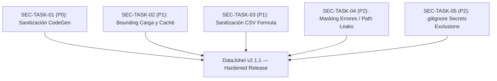

# Plan de Mitigación de Seguridad — DataJohei

**Fuente de Auditoría:** [`docs/security/security-audit.md`](file:///home/nico/projects/dataviz/docs/security/security-audit.md)  
**Alcance:** Vulnerabilidades confirmadas que requieren modificaciones de código o configuración (SEC-01 a SEC-05).  
**Metodología:** TDD estricto de seguridad (Red-Green-Refactor). Cada tarea exige un test automatizado que falle demostrando el vector de ataque/falla (RED) y luego pase tras la remediación (GREEN).

---

## Matriz de Tareas de Seguridad

| ID | Vulnerabilidad / Tarea | Severidad | CWE | Componentes Principales | Estado |
| :--- | :--- | :---: | :---: | :--- | :---: |
| **SEC-TASK-01** | Sanitización y Escape de Identificadores en CodeGen | **HIGH** | CWE-94, CWE-116 | [`src/cleaning.py`](file:///home/nico/projects/dataviz/src/cleaning.py), [`src/codegen.py`](file:///home/nico/projects/dataviz/src/codegen.py) | **COMPLETADA** |
| **SEC-TASK-02** | Límite de Tamaño de Carga y Bounding de Memoria en Caché | **MEDIUM** | CWE-400, CWE-776 | [`src/loader.py`](file:///home/nico/projects/dataviz/src/loader.py), [`src/views/sidebar_view.py`](file:///home/nico/projects/dataviz/src/views/sidebar_view.py) | **COMPLETADA** |
| **SEC-TASK-03** | Sanitización de Prefijos de Fórmulas en Exportación CSV | **MEDIUM** | CWE-1236 | [`src/views/export_view.py`](file:///home/nico/projects/dataviz/src/views/export_view.py) | **COMPLETADA** |
| **SEC-TASK-04** | Enmascaramiento de Rutas Internas y Excepciones en UI | **LOW-MED** | CWE-209 | [`src/loader.py`](file:///home/nico/projects/dataviz/src/loader.py), [`src/views/sidebar_view.py`](file:///home/nico/projects/dataviz/src/views/sidebar_view.py), [`src/views/cleaning_view.py`](file:///home/nico/projects/dataviz/src/views/cleaning_view.py) | **COMPLETADA** |
| **SEC-TASK-05** | Reglas de Exclusión de Secretos y Datasets en `.gitignore` | **LOW** | CWE-538 | [`.gitignore`](file:///home/nico/projects/dataviz/.gitignore) | **COMPLETADA** |

---

### SEC-TASK-01: [COMPLETADA] Sanitización y Escape de Identificadores en CodeGen (SEC-01)

* **Prioridad:** P0 (Inmediata / Bloqueante)
* **Severidad:** High (CVSS: 7.8) — CWE-94, CWE-116
* **Componentes Afectados:**
  * [`src/cleaning.py`](file:///home/nico/projects/dataviz/src/cleaning.py) ([`ImputeCommand`](file:///home/nico/projects/dataviz/src/cleaning.py), [`CastCommand`](file:///home/nico/projects/dataviz/src/cleaning.py), [`OutlierFilterCommand`](file:///home/nico/projects/dataviz/src/cleaning.py), [`DropDuplicatesCommand`](file:///home/nico/projects/dataviz/src/cleaning.py))
  * [`src/codegen.py`](file:///home/nico/projects/dataviz/src/codegen.py)
  * [`tests/test_codegen.py`](file:///home/nico/projects/dataviz/tests/test_codegen.py)

#### Descripción y Mecánica de Remediación
Los comandos de transformación interpolan nombres de columna directamente con f-strings (`f"df['{self.col}']"`), permitiendo inyección de código downstream al ejecutar pipelines exportados (`pipeline_limpieza.py` o `.ipynb`) si una columna contiene comillas o saltos de línea con payloads de Python.  
Se debe sanitizar la generación de código utilizando representación literal segura (`{self.col!r}` o `repr()`) en todos los métodos `to_code()`.

#### Criterios de Aceptación
1. Ningún método `to_code()` en [`src/cleaning.py`](file:///home/nico/projects/dataviz/src/cleaning.py) debe realizar interpolación directa sin formateo `!r` para nombres de columnas o subconjuntos de columnas.
2. Nombres de columnas con caracteres como comillas simples (`'`), dobles (`"`), saltos de línea (`\n`), backslashes (`\`) o payloads maliciosos (`col'] = 1\nimport os...`) deben exportarse como strings escapados válidos en Python.
3. Los scripts y notebooks generados deben compilarse mediante `ast.parse()` sin ejecutar código inyectado.

#### Test de Seguridad Automatizado (TDD RED / GREEN)
* **Archivo de Test:** `tests/test_security_codegen.py`
* **Fase RED (Fallo inicial):**
  * Crear un caso de prueba `test_codegen_prevents_code_injection_in_column_names` que instancie `ImputeCommand`, `CastCommand` y `OutlierFilterCommand` con una columna maliciosa:  
    `col = "col'] = 1\nimport os; os.system('echo pwned')\n#"`
  * Invocar `cmd.to_code()` y verificar si el código resultante contiene sentencias ejecutables sin escapar o si al evaluarlo sintácticamente con `ast.parse()` se detectan nodos no deseados fuera del subscript. El test falla en la implementación actual porque la comilla rompe el string.
* **Fase GREEN (Paso tras fix):**
  * Con `{self.col!r}`, el código generado es `df['col\'] = 1\nimport os; os.system(\'echo pwned\')\n#']...`, tratándose puramente como clave literal de diccionario, y el test pasa.

---

### SEC-TASK-02: [COMPLETADA] Límite de Tamaño de Carga y Bounding de Memoria en Caché (SEC-02)

* **Prioridad:** P1 (Alta)
* **Severidad:** Medium (CVSS: 5.3) — CWE-400, CWE-776
* **Componentes Afectados:**
  * [`src/loader.py`](file:///home/nico/projects/dataviz/src/loader.py) ([`load_tabular_file`](file:///home/nico/projects/dataviz/src/loader.py))
  * [`src/views/sidebar_view.py`](file:///home/nico/projects/dataviz/src/views/sidebar_view.py)

#### Descripción y Mecánica de Remediación
1. Establecer un límite máximo explícito de tamaño de archivo (guardrail, ej. 100 MB / `MAX_UPLOAD_SIZE_BYTES = 100 * 1024 * 1024`) antes de procesar el stream para prevenir memory bombs y denegación de servicio.
2. Limitar el almacenamiento en caché de Streamlit con `@st.cache_data(max_entries=20, ttl=3600, show_spinner=False)`.
3. Prevenir ReDoS/CPU starvation eliminando o delimitando el fallback de `sep=None` con el engine `python` en archivos de gran tamaño.

#### Criterios de Aceptación
1. Si el archivo recibido supera `MAX_UPLOAD_SIZE_BYTES`, `load_tabular_file` debe rechazar la carga inmediatamente con un `ValueError` descriptivo sin intentar parsearlo completamente en RAM.
2. La función `@st.cache_data` en [`src/loader.py`](file:///home/nico/projects/dataviz/src/loader.py) debe tener configurados `max_entries` y `ttl`.

#### Test de Seguridad Automatizado (TDD RED / GREEN)
* **Archivo de Test:** `tests/test_security_loader.py`
* **Fase RED (Fallo inicial):**
  * Crear un test `test_loader_rejects_payload_exceeding_max_size` que pase a `load_tabular_file` un buffer `io.BytesIO` cuyo tamaño exceda el límite permitido (o simule `uploaded.size > MAX_BYTES`).
  * Verificar que `load_tabular_file` actualmente intenta parsear el payload sin validar su tamaño.
  * Crear un test `test_loader_cache_has_retention_bounds` que inspeccione los metadatos de configuración de `@st.cache_data` en `load_tabular_file` y falle si `max_entries` o `ttl` son `None`.
* **Fase GREEN (Paso tras fix):**
  * Se agrega la validación de tamaño y los parámetros de retención en `load_tabular_file`. Ambos tests pasan exitosamente.

---

### SEC-TASK-03: [COMPLETADA] Sanitización de Prefijos de Fórmulas en Exportación CSV (SEC-03)

* **Prioridad:** P1 (Alta)
* **Severidad:** Medium (CVSS: 4.8) — CWE-1236
* **Componentes Afectados:**
  * [`src/views/export_view.py`](file:///home/nico/projects/dataviz/src/views/export_view.py) ([`get_csv_bytes`](file:///home/nico/projects/dataviz/src/views/export_view.py))

#### Descripción y Mecánica de Remediación
Cuando el dataset contiene celdas de texto que comienzan con caracteres de fórmula (`=`, `+`, `-`, `@`, `\t`, `\r`), exportar directamente a CSV permite ataques de Formula / DDE Injection al abrir el archivo en Excel o Calc.  
Se debe sanitizar el DataFrame en `get_csv_bytes` prefijando una comilla simple (`'`) a las celdas de texto que inicien con estos caracteres antes de serializar a CSV.

#### Criterios de Aceptación
1. Ninguna celda de tipo string serializada en el archivo CSV generado debe comenzar con `=`, `+`, `-`, `@`, `\t` ni `\r` sin el escape/prefijo seguro `'`.
2. Las columnas numéricas legítimas (enteros, flotantes negativos como `-42.5`) deben preservar su tipo y formato numérico sin alteraciones innecesarias.
3. La exportación Parquet permanece inalterada por ser un formato binario inmune.

#### Test de Seguridad Automatizado (TDD RED / GREEN)
* **Archivo de Test:** `tests/test_security_export.py`
* **Fase RED (Fallo inicial):**
  * Crear un test `test_csv_export_escapes_formula_prefixes` con un `pd.DataFrame` conteniendo celdas como `"=cmd|'/C calc'!A0"`, `"-2+3"`, `"@SUM(A1:A10)"`, `"+12345"`, `"=HYPERLINK(...)"`.
  * Llamar a `get_csv_bytes(df)` y decodificar el contenido CSV.
  * Comprobar que en la versión actual las celdas se exportan directamente con el prefijo peligroso al inicio de campo. El test falla en RED.
* **Fase GREEN (Paso tras fix):**
  * Al aplicar el sanitizador de prefijos en `get_csv_bytes`, las celdas resultan en `"'=cmd|...", "'@SUM..."`, etc., y el test pasa.

---

### SEC-TASK-04: [COMPLETADA] Enmascaramiento de Rutas Internas y Excepciones en UI (SEC-04)

* **Prioridad:** P2 (Media)
* **Severidad:** Low-Medium (CVSS: 4.3) — CWE-209
* **Componentes Afectados:**
  * [`src/loader.py`](file:///home/nico/projects/dataviz/src/loader.py)
  * [`src/views/sidebar_view.py`](file:///home/nico/projects/dataviz/src/views/sidebar_view.py)
  * [`src/views/cleaning_view.py`](file:///home/nico/projects/dataviz/src/views/cleaning_view.py)

#### Descripción y Mecánica de Remediación
Actualmente, los errores de carga o parsing propagan excepciones completas hacia la UI (`st.error(str(e))` / `RuntimeError(f"Error cargando {filename}: {str(e)}")`), exponiendo rutas absolutas del servidor (`/home/nico/...`), detalles de bibliotecas internas C++ (PyArrow) y stack traces.  
Se deben sanitizar los mensajes de error presentados al usuario final, manteniendo el detalle técnico exclusivamente en logging interno.

#### Criterios de Aceptación
1. Los mensajes de error expuestos por `load_tabular_file` o capturados en las vistas no deben incluir rutas absolutas de directorios del sistema operativo ni stack traces internos.
2. Los errores de formato, archivo corrupto o incompatibilidad deben mapearse a mensajes claros y genéricos (ej. *"No se pudo procesar el archivo. Verifique que el formato y la codificación sean válidos."*).

#### Test de Seguridad Automatizado (TDD RED / GREEN)
* **Archivo de Test:** `tests/test_security_loader.py`
* **Fase RED (Fallo inicial):**
  * Crear un test `test_loader_error_does_not_leak_filesystem_paths` que fuerce un error de lectura pasando un archivo corrupto con una ruta simulada `/home/secret_server/data/corrupted.parquet`.
  * Capturar la excepción lanzada y assertar que el mensaje contiene rutas de sistema (falla en RED).
* **Fase GREEN (Paso tras fix):**
  * Implementar el enmascaramiento y filtro de rutas en [`src/loader.py`](file:///home/nico/projects/dataviz/src/loader.py). El test valida que `re.search(r"(/home/|/var/|/tmp/|/usr/)", error_msg)` es `None`. El test pasa en GREEN.

---

### SEC-TASK-05: [COMPLETADA] Reglas de Exclusión de Secretos y Datasets en `.gitignore` (SEC-05)

* **Prioridad:** P2 (Media)
* **Severidad:** Low (CVSS: 3.3) — CWE-538
* **Componentes Afectados:**
  * [`.gitignore`](file:///home/nico/projects/dataviz/.gitignore)

#### Descripción y Mecánica de Remediación
El archivo `.gitignore` actual carece de patrones de exclusión para credenciales de Streamlit (`.streamlit/secrets.toml`), archivos de entorno (`.env`, `*.env`), certificados/llaves privadas (`*.pem`, `*.key`) y volcados de datos locales (`*.csv`, `*.parquet`, `*.xlsx`, `*.pkl`).

#### Criterios de Aceptación
1. El archivo [`.gitignore`](file:///home/nico/projects/dataviz/.gitignore) debe contener explícitamente las directivas de exclusión para secrets, entornos, claves criptográficas y artefactos de datos locales.

#### Test de Seguridad Automatizado (TDD RED / GREEN)
* **Archivo de Test:** `tests/test_security_config.py`
* **Fase RED (Fallo inicial):**
  * Crear un test `test_gitignore_contains_security_exclusions` que lea [`.gitignore`](file:///home/nico/projects/dataviz/.gitignore) y valide la existencia de los patrones requeridos (`.env`, `*.env`, `.streamlit/secrets.toml`, `*.pem`, `*.key`, `*.csv`, `*.parquet`, `*.xlsx`).
  * El test falla en RED con el [`.gitignore`](file:///home/nico/projects/dataviz/.gitignore) actual.
* **Fase GREEN (Paso tras fix):**
  * Se incorporan los patrones al archivo [`.gitignore`](file:///home/nico/projects/dataviz/.gitignore) y el test pasa en GREEN.

---

## Plan de Ejecución y Dependencias

